# Visitor Management System

A full-stack Visitor Management System developed using React, Go (Gin), PostgreSQL, and JWT authentication. The system streamlines visitor registration, check-in/check-out, user management, and reporting through a secure role-based platform.

## Features

- Secure user authentication (JWT)
- Role-based access control (Admin/User)
- Visitor registration and management
- Visitor check-in and check-out
- Dashboard with visitor statistics
- Search and filtering
- Reporting
- Responsive user interface

## Technologies Used

### Frontend
- React
- Vite
- Tailwind CSS
- Axios
- React Router

### Backend
- Go
- Gin Framework
- GORM
- PostgreSQL
- JWT Authentication

## Project Structure

```
visitor-management/
├── backend/
└── frontend/
```

## Installation

### Backend

```bash
cd backend
go mod tidy
go run main.go
```

### Frontend

```bash
cd frontend
npm install
npm run dev
```

## Screenshots

### API

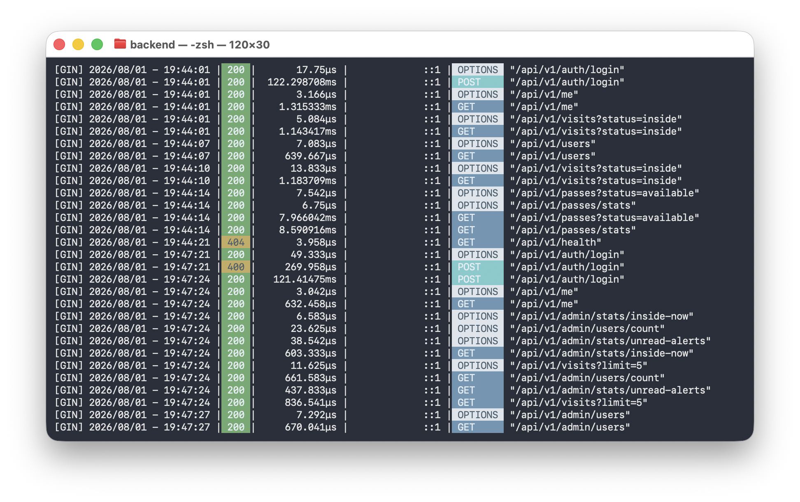

### Login

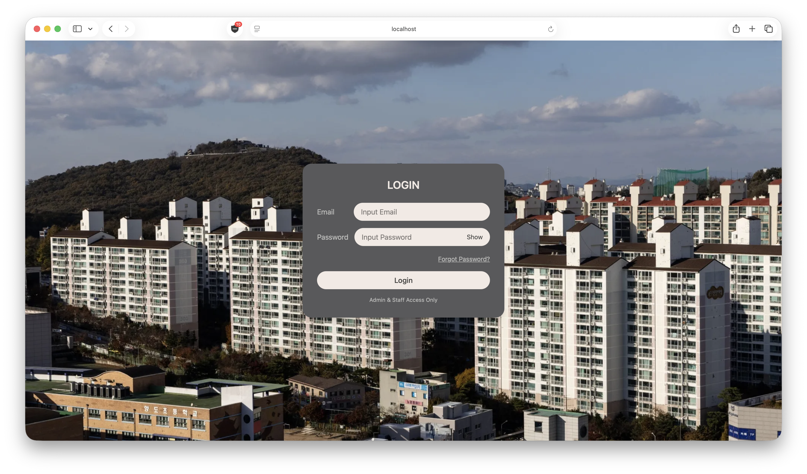

### Forgot Password

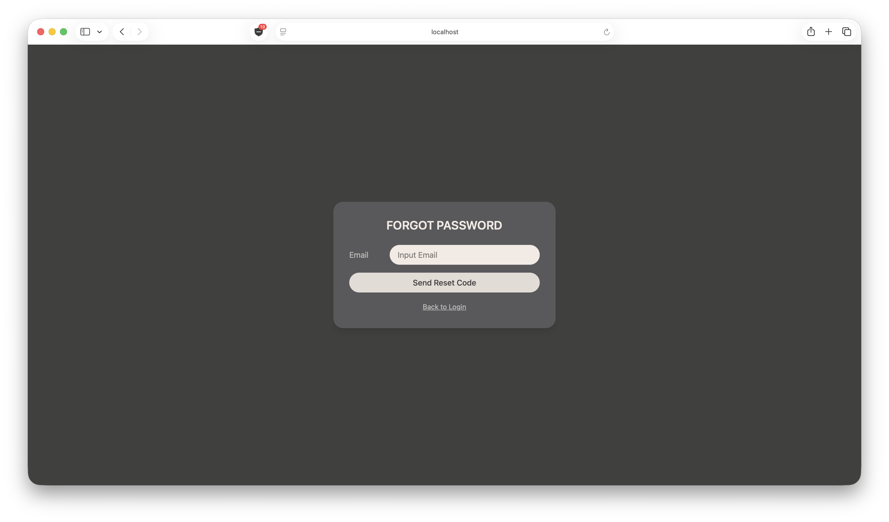

### Reset Password

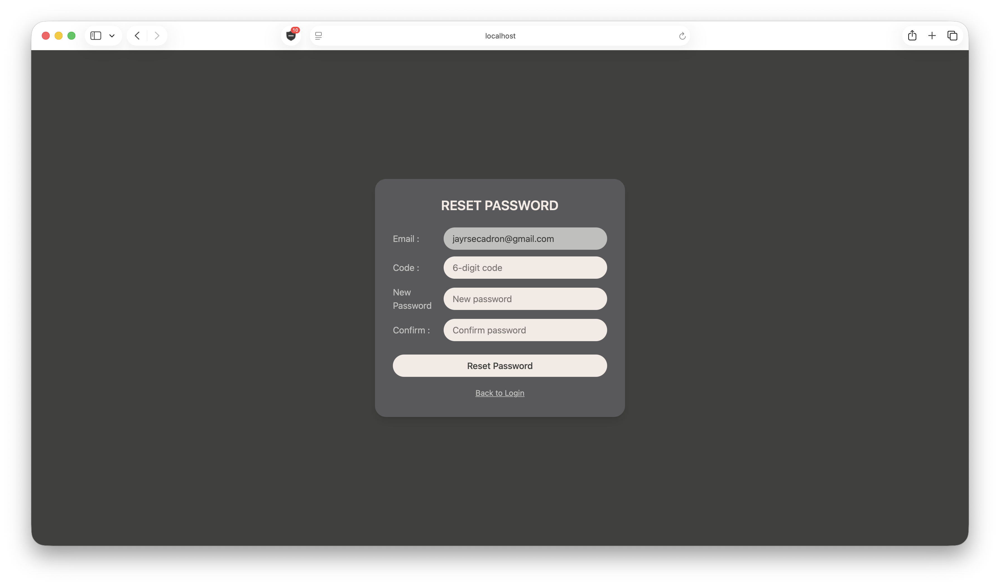

### Admin Dashboard

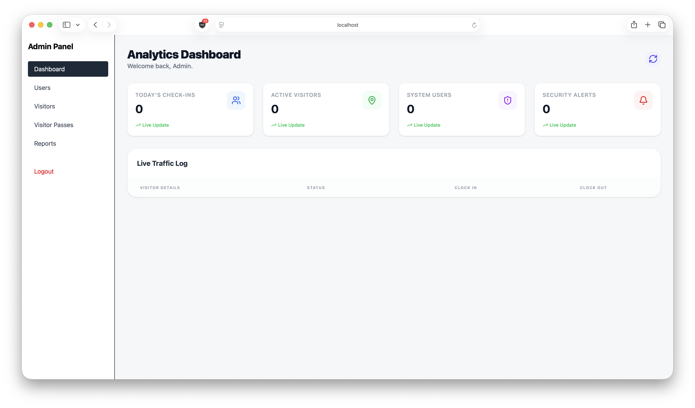

### Admin Users

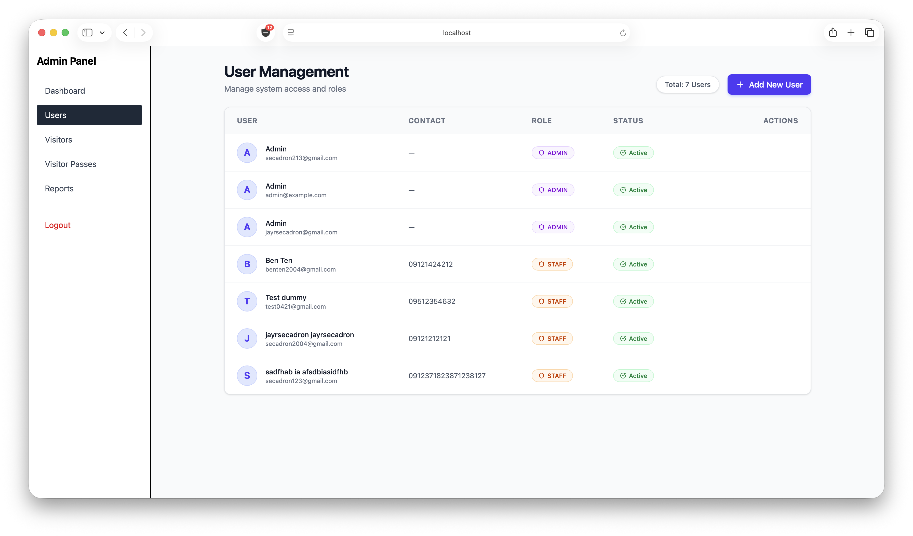

### Admin Visitors

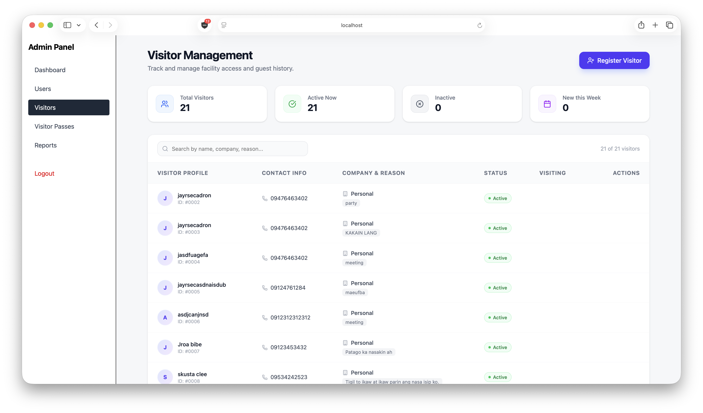

### Admin Visitor Passes

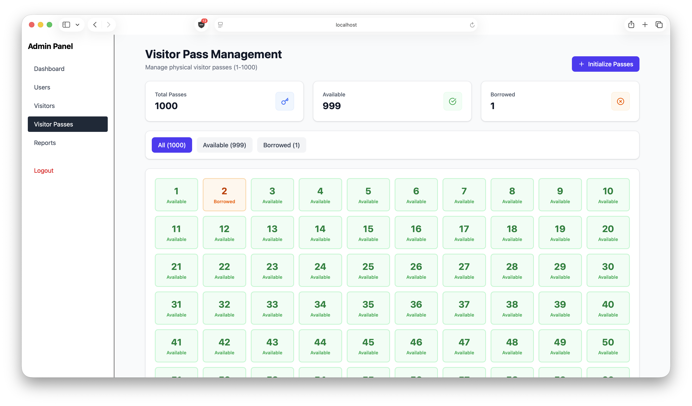

### Admin Reports

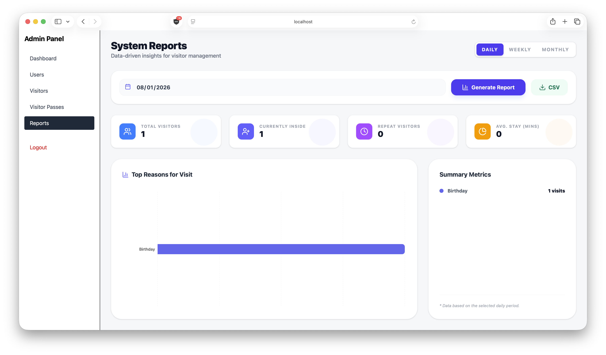

### Receptionist Check In

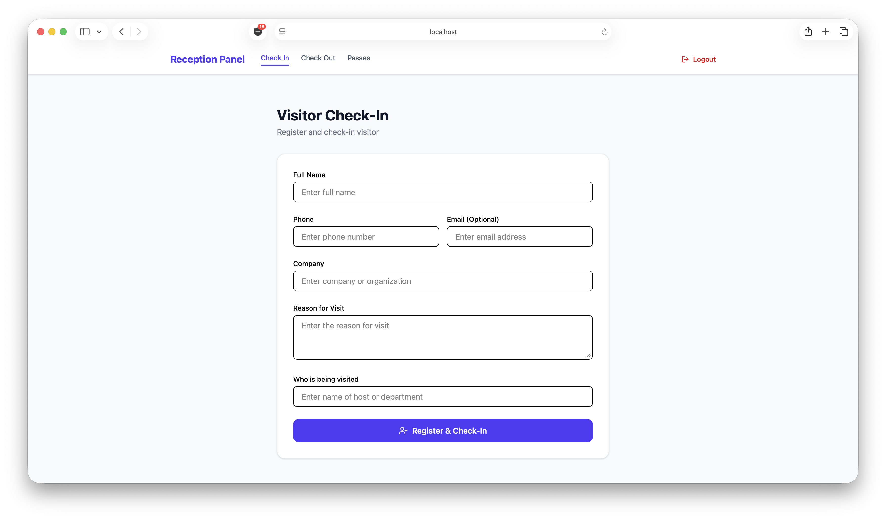

### Receptionist Check Out

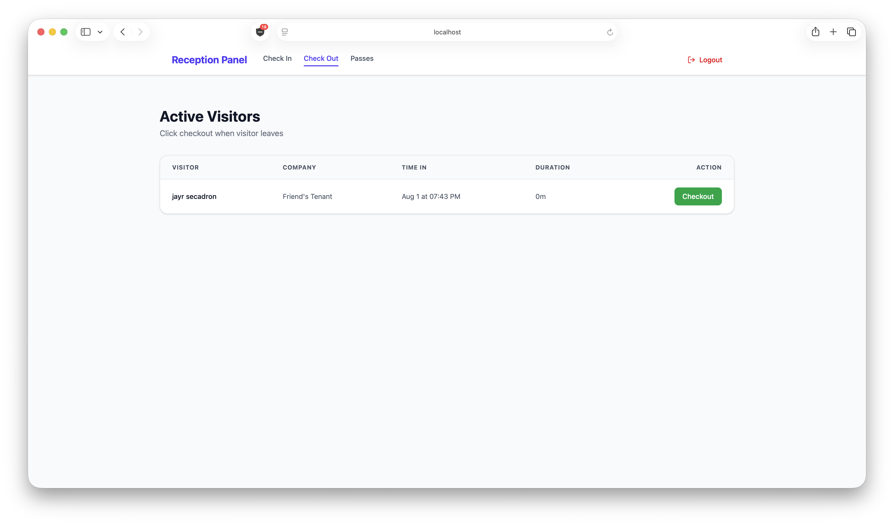

### Receptionist Passes

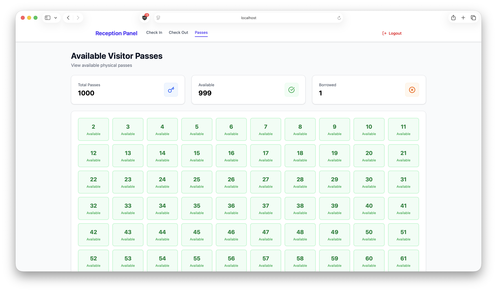

## Author

**Jayr Secadron**

Bachelor of Science in Computer Science

GitHub:
https://github.com/jayrsecadron0421

LinkedIn:
https://www.linkedin.com/in/jayrsecadron